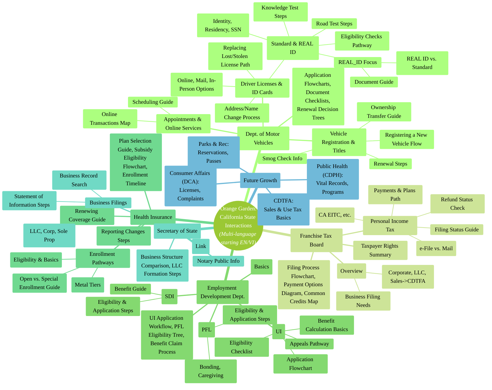

# Orange Garden: Cultivating Clarity in California Government

[](LICENSE) [](LICENSE-CC-BY) [](https://github.com/CongLeSolutionX/OrangeGarden/)

---

Copyright (c) 2025 Cong Le. All Rights Reserved.

---

**Welcome to Orange Garden!**

Navigating the complex pathways of California state government, with its intricate forms, procedures, and regulations, can often feel like wandering through a dense thicket. **Orange Garden** is an open-source initiative dedicated to bringing sunshine and clarity to this landscape. We aim to cultivate understanding by translating complex state processes into clear, accessible, and interactive visual diagrams, **eventually offering information in multiple languages, beginning with English and Vietnamese.**

Using `Mermaid.js`, we create flowcharts, mind maps, and visual guides that illuminate the steps, requirements, and decision points involved in common interactions with key California state departments, such as:

*   Department of Motor Vehicles (DMV) - Licensing, Registration, Real ID
*   Franchise Tax Board (FTB) - State Income Tax, Business Obligations
*   Employment Development Department (EDD) - Unemployment, Disability, Paid Leave
*   Covered California - Health Insurance Marketplace
*   Secretary of State (SoS) - Business Formation
*   Other vital state agencies and their functions.

Whether you're a resident seeking a permit, a business owner planting roots in California, a student exploring state civics, or anyone needing to find a clear path through state procedures, `Orange Garden` helps make complex processes bloom with clarity, **aiming for accessibility across linguistic communities.**

**`Orange Garden` shares a kinship with projects like [LegalLens](https://github.com/CongLeSolutionX/LegalLens/) (tech law), [AlgoVerse](https://github.com/CongLeSolutionX/AlgoVerse) (algorithms), [Synthetic Zooniverse](https://github.com/CongLeSolutionX/Synthetic-Zooniverse) (AI models), and [ArchExplorer](https://github.com/CongLeSolutionX/ArchExplorer) (software architectures). These projects all strive to enhance understanding through visualization.**

## Table of Contents

- [The Challenge & Our Approach: Tending the Thicket](#the-challenge--our-approach-tending-the-thicket)
- [Garden Plots: California Government Focus Areas](#garden-plots-california-government-focus-areas)
- [Navigating the Garden: Repository Structure](#navigating-the-garden-repository-structure)
- [Example Pathway: Simplified CA Driver's License Application](#example-pathway-simplified-ca-drivers-license-application)
- [Getting Started](#getting-started)
- [Exploring the Garden: How to Use Orange Garden](#exploring-the-garden-how-to-use-orange-garden)
- [Companion iOS App: Orange Garden Mobile](#companion-ios-app-orange-garden-mobile)
- [Help the Garden Grow: Contributing](#help-the-garden-grow-contributing)
- [License](#license)
- [**Important Disclaimer**](#important-disclaimer)
- [Markdown and Visualization Resources](#markdown-and-visualization-resources)

---

## The Challenge & Our Approach: Tending the Thicket

Official government resources, while authoritative, often present information in dense text or sprawling forms, making it difficult to quickly grasp the necessary steps or requirements. These tangled processes can be discouraging. `Orange Garden` seeks to prune away the complexity and cultivate clarity by offering a visual layer, helping you:

*   **Find Clear Pathways:** Quickly understand the main routes, milestones, and timelines in common government interactions.
*   **Visualize the Journey:** See application flows, decision points, required documentation trails, and procedural steps laid out clearly.
*   **Identify Key Elements:** Easily spot necessary documents, eligibility requirements, and available options.
*   **Map Agency Plots:** Understand which divisions or forms are involved at different stages within an agency.
*   **Learn Through Examples:** Study visual breakdowns of common procedures (like getting a Real ID or filing for PFL) to feel more prepared.
*   **Share Understanding:** Use the diagrams to explain these processes clearly to others.
*   **Navigate with Confidence:** Use visual guides to chart a course through potentially confusing bureaucratic landscapes.

**Our Method:**

1.  **Survey the Land:** We review official California state government websites (e.g., dmv.ca.gov, ftb.ca.gov), forms, and guidelines.
2.  **Plant Seeds of Clarity:** We choose appropriate Mermaid diagram types (flowcharts, checklists, etc.) to best illustrate each process or policy.
3.  **Provide Sunlight & Water:** Each diagram is accompanied by concise text explaining the steps, their importance, and direct links to official state sources.
4.  **Trace the Roots:** We prioritize linking directly to official `.ca.gov` source pages for the most current and detailed information.
5.  **Cultivate Accuracy:** We aim for simplified, accurate visual paths, focusing on essential information. *Note: These are interpretations, not replacements for official guidance.*
6.  **Grow Together:** We invite community contributions to expand the garden, adding more pathways and improving existing ones.
7.  **Broaden Reach:** **We plan to translate content and diagrams, starting with English and Vietnamese, to serve more Californians.**

**This project aims to make understanding and navigating California state government a more fruitful experience for everyone.**

---

## Garden Plots: California Government Focus Areas

`Orange Garden` cultivates understanding across a variety of interactions with key California state departments. The mind map below outlines the "plots" currently being tended or planned for cultivation:



*This mind map serves as a guide to the topics covered. The repository structure reflects these departments and processes.*

---

## Navigating the Garden: Repository Structure

The repository is organized like a well-planned garden, with sections for each state department, further divided into specific services or processes:

```plaintext
OrangeGarden/
├── LICENSE                 # MIT License (for code/diagram source)
├── LICENSE-CC-BY           # CC BY 4.0 License (for documentation/text)
├── README.md               # This overview file
│
├── en/                     # English Content Root (Planned Structure)
│   ├── DMV/
│   │   └── ... (folders as before)
│   ├── FTB/
│   │   └── ...
│   └── ...
├── vi/                     # Vietnamese Content Root (Planned Structure)
│   ├── DMV/
│   │   └── README_vi.md # Example Vietnamese README
│   │   └── diagrams/
│   │       └── new_license_application_flow_vi.mmd # Example Vietnamese Diagram
│   ├── FTB/
│   │   └── ...
│   └── ...
│
# --- Legacy Structure (Will be Migrated into en/ gradually) ---
├── DMV/                    # Department of Motor Vehicles Plot
│   ├── DriversLicense/
│   │   ├── README.md       # Driver's License pathways, guides, diagrams (Initially English)
│   │   └── diagrams/       # Mermaid source files (.mmd) for Driver's Licenses
│   │       ├── new_license_application_flow.mmd
│   │       ├── real_id_documents.mmd
│   │       └── ...
│   ├── VehicleRegistration/
│   │   ├── README.md
│   │   └── diagrams/
│   │       └── ...
│   └── _GeneralInfo/       # General DMV topics (e.g., Appointments)
│       ├── Appointments/
│       └── ...
# ... (Other departments structured similarly initially) ...

```

**Note:** We are transitioning towards a language-specific folder structure (`/en/`, `/vi/`, etc.) to better organize translated content. Initially, content might reside in the top-level department folders (assumed English) and will be migrated.

Within each specific topic folder (e.g., `DMV/DriversLicense/` or `en/DMV/DriversLicense/`):

*   **`README.md` (or `README_xx.md`):** Contains explanations of the government process, key steps, requirements, and the embedded Mermaid diagrams with textual walkthroughs in the specified language. Links to official California government source pages are provided.
*   **`diagrams/`:** Holds the raw `Mermaid.js` source code (`.mmd` files) for the visualizations presented in the README, potentially with language-specific filenames (e.g., `*_vi.mmd`).

---

## Example Pathway: Simplified CA Driver's License Application

This simplified flowchart illuminates the general path for applying for a new standard California Driver's License for the first time. *(This example is currently in English. Vietnamese version planned).*

```mermaid
---
title: "Orange Garden - Pathway: New CA Driver's License App (EN)"
author: "Cong Le"
version: "1.0"
license(s): "MIT, CC BY 4.0"
copyright: "Copyright (c) 2025 Cong Le. All Rights Reserved."
config:
  layout: elk
  look: handDrawn
  theme: forest
---
%%%%%%%% Mermaid version v11.4.1-b.14
%%%%%%%% Toggle theme value to `base` to activate the initilization below for the customized theme version.
%%%%%%%% Available curve styles include the following keywords:
%% basis, bumpX, bumpY, cardinal, catmullRom, linear, monotoneX, monotoneY, natural, step, stepAfter, stepBefore.
%%{
  init: {
    'graph': { 'htmlLabels': false, 'curve': 'linear' },
    'fontFamily': 'Monospace',
    'themeVariables': {
      'primaryColor': '#BEF',
      'primaryTextColor': '#55ff',
      'primaryBorderColor': '#7c2',
      'lineColor': '#F8B229',
      'secondaryColor': '#EE2',
      'tertiaryColor': '#fff',
      'stroke':'#3323',
      'stroke-width': '0.5px'
    }
  }
}%%
graph TD
    A["Start:<br>Need New CA Driver's License"] --> B["Step 1:<br/>Complete Online App<br>(Do this *before* DMV visit)"]
    B --> C["Step 2:<br/>Gather Docs<br>(ID, Residency, SSN, etc.)"]
    C --> D{"Step 3:<br/>Schedule DMV Appointment?<br>(Recommended)"}
    D -- Yes --> E["Step 4:<br/>Visit DMV Office"]
    D -- No --> E

    E --> F["Step 5:<br/>Submit Docs, Pay Fees<br>Photo, Thumbprint"]
    F --> G{"Step 6:<br/>Pass Vision Test?"}
    G -- Yes --> H{"Step 7:<br/>Pass Knowledge Test?"}
    G -- No --> Fail_Vision["Stop:<br>Vision Test Failed<br>(Needs correction/exam)"]

    H -- Yes --> I{"Step 8:<br/>Driving Lessons Needed?<br>(Required if <18)"}
    H -- No --> Fail_Knowledge["Stop:<br>Knowledge Test Failed<br>(Study & Retest Needed)"]

    I -- Yes / Not Required --> J{"Step 9:<br/>Pass Driving Test?"}
    J -- Yes --> K["Step 10:<br/>Get Interim License"]
    K --> L["Step 11:<br/>Official License Arrives by Mail"]
    J -- No --> Fail_Driving["Stop:<br>Driving Test Failed<br>(Practice & Retest Needed)"]

    style Fail_Vision fill:#f99,stroke:#333,stroke-width:2px
    style Fail_Knowledge fill:#f99,stroke:#333,stroke-width:2px
    style Fail_Driving fill:#f99,stroke:#333,stroke-width:2px
    style L fill:#ccf,stroke:#333,stroke-width:2px

    %% Note: This simplifies many details (like REAL ID). Always check official DMV site!

```



**Diagram Explanation:** *(English)*

1.  **Start:** You need a California Driver's License.
2.  **Online Application:** First step: complete the application online before going to the DMV.
3.  **Gather Documents:** Collect proofs of identity, residency, SSN, etc. (Check DMV site for exact needs!).
4.  **Appointment:** Booking an appointment online is strongly advised.
5.  **Visit DMV:** Go to your appointment (or walk-in).
6.  **Submit & Process:** Hand over documents, pay fees, get your photo/thumbprint taken.
7.  **Vision Test:** A basic eye exam.
8.  **Knowledge Test:** Written test on road rules. Failing means you'll need to retest.
9.  **Driving Lessons:** Minors have mandatory training requirements.
10. **Driving Test:** Practical test of your driving skills. Failing requires a retest fee and waiting period.
11. **Receive License:** Pass everything? Get a temporary license first, then the official card via mail.

*This is a simplified path. Your specific situation (age, REAL ID choice, etc.) matters. Always get the latest details from the official California DMV website (dmv.ca.gov).*

---

## Getting Started

### Prerequisites

*   **Web Browser:** Any modern browser to view the diagrams on GitHub.
*   **(Optional) Git:** To download ("clone") the garden for offline viewing or contributing.
*   **(Optional) Markdown Editor:** Useful for viewing/editing files locally (like VS Code with Mermaid extensions).

### Cloning the Repository (Optional)

```bash
# TODO: Update GitHub clone URL
git clone https://github.com/YourGitHubUsername/OrangeGarden.git
cd OrangeGarden
```

---

## Exploring the Garden: How to Use Orange Garden

1.  **Wander the Plots:** Navigate the folders organized by state department (DMV, FTB, EDD...) and soon by language (`/en/`, `/vi/`).
2.  **Read the Signposts (`README.md`):** Each topic's README file is your guide, offering explanations and the visual diagrams in the selected language.
3.  **Study the Pathways (Diagrams):** Examine the Mermaid charts. Follow the arrows, understand the steps and decision points.
4.  **Understand the Context:** Read the text accompanying each diagram to grasp the details and significance.
5.  **Check the Official Source:** **Most importantly, use the provided links** to visit the official California government websites (*.ca.gov). Rules and forms change – always verify there!
6.  **(Locally) Inspect the Seeds (`.mmd` Files):** If you cloned the repository, you can view the raw Mermaid code in the `diagrams/` folders.

---

## Companion iOS App: Orange Garden Mobile

Explore California government information on the go! We offer the **Orange Garden iOS app**, designed to provide convenient mobile access to resources and information related to California state departments.

**Features:**

*   **Mobile-Friendly Access:** Browse information about various state services and processes directly from your iPhone or iPad.
*   **Leverages Open Data:** The app utilizes publicly available information, drawing data shared through the **California Open Data Portal (data.ca.gov)** and other official public sources from state departments.
*   **Complements Visualizations:** While this repository focuses on visual process diagrams, the app provides related information and direct access to resources in a mobile format.
*   **Multi-Language Support:** The app interface and content are planned to be available in **English and Vietnamese**, with more languages to follow.

**Download the App:**

*   [**Orange Garden on the App Store**] <!-- **<- TODO: Add App Store Link Here** -->

*(Note: The app and this repository are companion projects. The app may offer different features or data presentations compared to the diagrams found here.)*

---

## Help the Garden Grow: Contributing

Your contributions can help `Orange Garden` flourish into an even more comprehensive and helpful resource! We welcome additions, corrections, and improvements.

**How to Contribute:**

1.  **Take a Cutting (Fork):** Create your own copy (fork) of the `OrangeGarden` repository.
2.  **Start a New Branch:** Make a branch in your fork for your changes (e.g., `feature/vi/dmv-drivers-license`, `fix/update-ftb-links`).
3.  **Cultivate Your Addition:**
    *   Choose a CA government process or policy to visualize, refine, or **translate**.
    *   Craft clear, accurate Mermaid diagrams (`.mmd` files in the correct `diagrams/` folder, potentially with language suffixes like `_vi.mmd`).
    *   Write helpful explanations in the `README.md` (or `README_xx.md` for translations).
    *   **Crucially, reference and link to the official California government source(s).**
    *   Follow the garden's organizing structure (by department and/or language).
4.  **Review Your Work:** Ensure Markdown and diagrams render correctly on GitHub.
5.  **Offer Your Contribution (Pull Request):** Submit a PR from your branch to the main `OrangeGarden` repository. Clearly describe your changes, the official sources used, and **indicate the language** if it's a translation.
6.  **Tend the Discussion:** Be ready to discuss your PR and make adjustments.

**Specific Needs:**

*   **Translators:** We are actively seeking contributors fluent in **Vietnamese** (and other languages later) to help translate existing diagrams and explanations. If you can help bridge the language gap, your contribution would be invaluable! Please look for issues tagged 'translation' or propose translations via PRs.

*Please keep contributions informative and neutral. A formal Code of Conduct and detailed `CONTRIBUTING.md` are planned.*

---

## License

This project uses two licenses:

*   **Diagram Code & Source:** All `Mermaid.js` source files (`.mmd`) and other code are under the [**MIT License**](LICENSE). (Reuse of the diagram code is flexible).
*   **Textual Content:** All explanations, `README.md` files, etc., are under the [**Creative Commons Attribution 4.0 International License (CC BY 4.0)**](LICENSE-CC-BY). (Attribute us if you reuse the text).

---

## **Important Disclaimer**

**The information, diagrams, and explanations provided in the `Orange Garden` repository AND the companion iOS app are for educational and informational purposes ONLY. They are NOT official government advice, guidance, or guarantees.**

*   California state laws, regulations, procedures, forms, requirements, and fees are complex, depend on individual situations, and **change often.** Updates may occur that are not yet reflected here or in the app. Language translations add another layer where nuance might be lost; always verify with official sources.
*   Visualizations are simplified interpretations to aid understanding and may omit nuances, exceptions, or the very latest changes.
*   **ALWAYS consult the official California state government websites (e.g., dmv.ca.gov, ftb.ca.gov, edd.ca.gov, sos.ca.gov, coveredca.com) as the primary source of truth.** If needed, contact the relevant department directly or seek advice from qualified professionals (legal, tax, etc.). The official English versions of state websites are typically the definitive source.
*   **DO NOT rely solely on this repository or the companion app for making decisions about government interactions, deadlines, eligibility, or compliance.** The maintainers and contributors are not liable for actions taken based on this information. **Verify everything with official California sources before acting.**

---

## Markdown and Visualization Resources

*   **GitHub Markdown Guide:** [Basic writing and formatting syntax](https://docs.github.com/en/get-started/writing-on-github/getting-started-with-writing-and-formatting-on-github/basic-writing-and-formatting-syntax)
*   **Mermaid.js Official Documentation:** [https://mermaid.js.org/](https://mermaid.js.org/)
*   **Mermaid Live Editor (for testing):** [https://mermaid.live/](https://mermaid.live/)
*   **California Open Data Portal:** [https://data.ca.gov/](https://data.ca.gov/)

---


